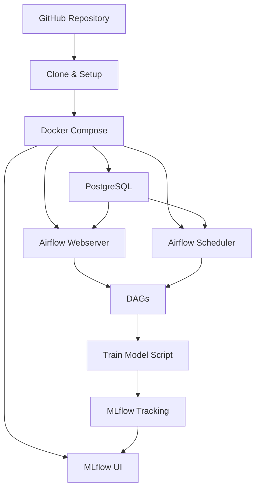

# 🚀 MLOps Project - Pipeline Completo de Machine Learning

[](https://www.docker.com/)
[](https://airflow.apache.org/)
[](https://mlflow.org/)
[](https://python.org/)

## 📋 Trabajo Final - MLOps 1

Este proyecto constituye el **Trabajo Final** para la materia **MLOps 1** del programa de posgrado. Se dedicó a la implementación de un pipeline completo de Machine Learning Operations (MLOps) que integra las mejores prácticas de la industria para el desarrollo, despliegue y monitoreo de modelos de machine learning en producción.

El proyecto se enfoca en la **automatización del proceso de entrenamiento** de modelos de regresión utilizando técnicas de aprendizaje automático, específicamente implementando un **RandomForestRegressor** para la predicción de descuentos comerciales. La solución combina **Apache Airflow** para la orquestación de workflows y **MLflow** para el tracking de experimentos y modelos, todo containerizado con Docker para facilitar el despliegue y la reproducibilidad.

## 👥 Integrantes del Grupo

Los integrantes del grupo, ordenados alfabéticamente:

- **Calabia, Juan Manuel**
- **Canal, David**
- **Cofré Villalón, Francisco**
- **Diaz, Natalia Beatriz**
- **Vasquez, Jorge**

---

Un pipeline completo de MLOps que combina **Apache Airflow** para orquestación de workflows y **MLflow** para tracking de experimentos y modelos. Diseñado para ser fácil de usar desde GitHub con un solo comando.

## ✨ Características

- 🔄 **Orquestación**: Apache Airflow para workflows de ML
- 📊 **Tracking**: MLflow para experimentos y modelos
- 🐳 **Containerizado**: Todo en Docker para fácil despliegue
- 🚀 **Setup Automático**: Un comando para configurar todo
- 📈 **Monitoreo**: Interfaces web para Airflow y MLflow
- 🔧 **Desarrollo**: Makefile con comandos útiles

## 🏗️ Arquitectura



## 📁 Estructura del Proyecto

```
MLOps1/
├── 📁 dags/                    # DAGs de Airflow
│   └── train_model_dag.py      # DAG para entrenamiento
├── 📁 scripts/                 # Scripts de Python
│   └── train_model.py          # Script de entrenamiento
├── 📁 data/                    # Datos de entrenamiento
│   └── df.pkl                  # Dataset principal
├── 📁 mlruns/                  # MLflow tracking store
├── 🐳 docker-compose.yaml      # Configuración de servicios
├── 🐳 Dockerfile.airflow       # Imagen personalizada
├── 📋 requirements.txt         # Dependencias Python
├── ⚙️ Makefile                 # Comandos útiles
├── 🚀 setup.sh                 # Script de configuración
├── 📖 README.md                # Este archivo
└── 🔧 env.example              # Variables de entorno
```

## 🚀 Inicio Rápido

### Prerrequisitos

- **Docker Desktop** (versión 4.0+)
- **Git** (para clonar el repositorio)
- **Make** (opcional, pero recomendado)

### 🎯 Instalación en 3 Pasos

1. **Clonar el repositorio:**
   ```bash
   git clone <tu-repositorio-url>
   cd MLOps1
   ```

2. **Configuración automática (primera vez):**
   ```bash
   make setup
   ```
   
   ⚡ **Esto hace todo automáticamente:**
   - Construye las imágenes Docker
   - Inicializa la base de datos
   - Crea el usuario administrador
   - Ejecuta un entrenamiento inicial
   - Configura MLflow

3. **¡Listo! Accede a las interfaces:**
   - 🌐 **Airflow UI**: http://localhost:8080
   - 📊 **MLflow UI**: http://localhost:5001
   - 👤 **Credenciales**: `admin` / `admin`

### 🔄 Uso Diario

```bash
# Levantar servicios (después de la primera vez)
make up

# Ver estado de servicios
make status

# Ver logs en tiempo real
make logs

# Ejecutar entrenamiento manual
make train

# Abrir interfaces web
make ui

# Parar servicios
make down
```

## 📋 Comandos Disponibles

| Comando | Descripción | Cuándo usar |
|---------|-------------|-------------|
| `make setup` | 🚀 Configuración inicial completa | **Solo primera vez** |
| `make up` | ⬆️ Levantar servicios | Uso diario |
| `make down` | ⬇️ Parar servicios | Al terminar |
| `make restart` | 🔄 Reiniciar servicios | Si hay problemas |
| `make status` | 📊 Ver estado de contenedores | Verificar estado |
| `make logs` | 📝 Ver logs de todos los servicios | Debugging |
| `make train` | 🤖 Ejecutar entrenamiento | Entrenar modelo |
| `make ui` | 🌐 Abrir interfaces web | Acceso rápido |
| `make clean` | 🧹 Limpiar todo | Reset completo |
| `make reset` | 🔄 Reset completo | Empezar de cero |

## 🎯 Uso de las Interfaces

### 📊 Airflow UI (http://localhost:8080)

1. **Inicia sesión** con `admin` / `admin`
2. Ve a la pestaña **"DAGs"**
3. Encuentra el DAG `entrenamiento_modelo_ml`
4. **Activa el DAG** (toggle switch)
5. **Ejecuta manualmente** si es necesario

**Funcionalidades:**
- Monitoreo de workflows
- Ejecución manual de DAGs
- Visualización de logs
- Gestión de usuarios

### 🧪 MLflow UI (http://localhost:5001)

1. Ve a la pestaña **"Experiments"**
2. Selecciona el experimento **"Default"**
3. **Explora los runs** de entrenamiento
4. **Compara métricas** entre runs
5. **Descarga modelos** entrenados

**Funcionalidades:**
- Tracking de experimentos
- Comparación de modelos
- Visualización de métricas
- Descarga de artefactos

## 🤖 Entrenamiento de Modelos

### Script de Entrenamiento

El script `scripts/train_model.py` entrena un **RandomForestRegressor** con:

- **📊 Datos**: Carga desde `data/df.pkl`
- **🎯 Target**: Variable `descuento`
- **📈 Métricas**: MAE, RMSE, R2, tiempo de entrenamiento
- **📝 Tracking**: Parámetros y métricas en MLflow

### Parámetros del Modelo

```python
best_params = {
    'n_estimators': 30,
    'max_depth': 12,
    'min_samples_split': 2,
    'min_samples_leaf': 1
}
```

### Ejecutar Entrenamiento

```bash
# Opción 1: Desde Airflow UI
# Activa el DAG y ejecuta manualmente

# Opción 2: Desde terminal
make train

# Opción 3: Directo con Docker
docker compose exec airflow-webserver python /opt/airflow/scripts/train_model.py
```

## 🔧 Configuración Avanzada

### Variables de Entorno

Copia `env.example` a `.env` y modifica según necesites:

```bash
cp env.example .env
```

### Puertos Personalizados

Si necesitas cambiar los puertos, edita `docker-compose.yaml`:

```yaml
ports:
  - "8080:8080"  # Airflow UI
  - "5001:5000"  # MLflow UI
  - "5432:5432"  # PostgreSQL
```

### Agregar Datos

1. Coloca tu archivo de datos en `data/df.pkl`
2. Asegúrate de que tenga la columna `descuento`
3. Reinicia los servicios: `make restart`

## 🔍 Troubleshooting

### ❌ Problemas Comunes

| Problema | Solución |
|----------|----------|
| **"Database not initialized"** | `make init` |
| **Servicios no arrancan** | `make clean && make setup` |
| **Error de permisos** | `chmod -R 777 mlruns/` |
| **Puerto ocupado** | Cambia puertos en `docker-compose.yaml` |
| **Sin datos** | Coloca `df.pkl` en `data/` |

### 🔍 Verificación de Estado

```bash
# Ver contenedores corriendo
make ps

# Ver logs en tiempo real
make logs

# Ver logs específicos
make logs-airflow
make logs-mlflow

# Verificar conectividad
curl http://localhost:8080/health
curl http://localhost:5001/health
```

### 🆘 Reset Completo

Si todo falla, haz un reset completo:

```bash
make reset
```

Esto limpia todo y vuelve a configurar desde cero.

## 🛠️ Desarrollo

### Agregar Nuevos DAGs

1. Crea el archivo en `dags/`
2. Sigue el patrón de `train_model_dag.py`
3. Reinicia Airflow: `make restart`

### Modificar Scripts

1. Edita `scripts/train_model.py`
2. Los cambios se reflejan automáticamente
3. Ejecuta: `make train`

### Agregar Dependencias

1. Edita `requirements.txt`
2. Reconstruye: `make build`
3. Reinicia: `make restart`

## 📦 Tecnologías

| Tecnología | Versión | Propósito |
|------------|---------|-----------|
| **Apache Airflow** | 2.9.3 | Orquestación de workflows |
| **MLflow** | Latest | Tracking de experimentos |
| **PostgreSQL** | 13 | Base de datos |
| **Python** | 3.11 | Lenguaje de programación |
| **Docker** | Latest | Containerización |
| **scikit-learn** | Latest | Machine Learning |

## 🤝 Contribución

1. Fork el repositorio
2. Crea una rama: `git checkout -b feature/nueva-funcionalidad`
3. Commit: `git commit -m 'Agregar nueva funcionalidad'`
4. Push: `git push origin feature/nueva-funcionalidad`
5. Abre un Pull Request

## 📄 Licencia

Este proyecto es parte del trabajo final de MLOps.

## 🆘 Soporte

Si tienes problemas:

1. Revisa la sección [Troubleshooting](#-troubleshooting)
2. Verifica los logs: `make logs`
3. Haz un reset: `make reset`
4. Abre un issue en GitHub

---
